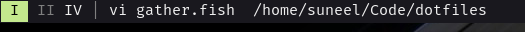

# Xmobar Config

I run xmobar on all my monitors, spawning one per each monitor. My workspaces and
active window title are provided by xmonad through xmobar's `UnsafeStdinReader`.

My [xmonad config](https://github.com/SuneelFreimuth/dotfiles/xmonad/xmonad.hs) shows how I spawn multiple xmobar instances and pretty-print the
data to `UnsafeStdinReader`.
